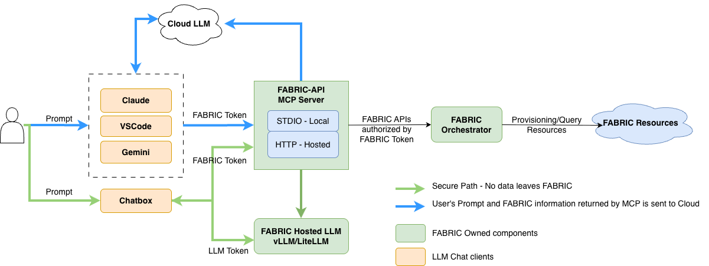

# FABRIC API MCP Server

A production-ready **Model Context Protocol (MCP)** server that exposes **FABRIC Testbed API** and inventory queries through `fabric_manager_v2`, designed for secure, token-based use by LLM clients (ChatGPT MCP, VS Code, Claude Desktop, etc.).

- **Stateless**: no user credentials stored; every call uses a **Bearer FABRIC ID token**
- **Deterministic tools** with strong logging, request IDs, and JSON/text log formats
- **Reverse-proxy friendly**: ships with NGINX front end
- **Resource cache** (optional) for fast site/host/link queries

---

## Table of contents

- [Quick install](#quick-install)
- [MCP client configuration](#mcp-client-configuration)
- [What this server provides](#what-this-server-provides)
- [Authentication](#authentication)
- [Architecture](#architecture)
- [Repo layout](#repo-layout)
- [Environment variables](#environment-variables)
- [Deploy with Docker Compose (Server Mode)](#deploy-with-docker-compose-server-mode)
- [Adding new tools](#adding-new-tools)
- [Local mode setup](#local-mode-setup)
- [Remote mode setup](#remote-mode-setup)
- [Local vs Remote — which to use?](#local-vs-remote--which-to-use)
- [Quick tool examples](#quick-tool-examples)
- [System prompt](#system-prompt)
- [Logging](#logging)
- [Resource cache](#resource-cache)
- [Monitoring & Metrics (Server Mode Only)](#monitoring--metrics-server-mode-only)
- [Security notes](#security-notes)

---

## Quick install

Set up FABRIC MCP with a single command:

```bash
# Local mode (full-featured: SSH to VMs, post-boot config)
curl -fsSL https://raw.githubusercontent.com/fabric-testbed/fabric_api_mcp/main/install.sh | bash -s -- --local

# Remote mode (connects to remote MCP server via mcp-remote)
curl -fsSL https://raw.githubusercontent.com/fabric-testbed/fabric_api_mcp/main/install.sh | bash -s -- --remote

# Both modes
curl -fsSL https://raw.githubusercontent.com/fabric-testbed/fabric_api_mcp/main/install.sh | bash -s -- --local --remote

# Headless environment (no browser)
curl -fsSL https://raw.githubusercontent.com/fabric-testbed/fabric_api_mcp/main/install.sh | bash -s -- --local --no-browser
```

The installer:
1. Creates `~/.fabric-api-mcp/` with a Python venv, config directory, and helper scripts
2. Installs `fabric_api_mcp` (which includes `fabric-cli`) into the venv
3. Runs `fabric-cli configure setup` to authenticate via CILogon and set up your FABRIC config (token, SSH keys, `fabric_rc`)
4. Prints the configured **project ID** and MCP client config snippet

> **Project selection:** By default, your first FABRIC project is used. The installer prints the project ID at the end. To change it later:
> ```bash
> ~/.fabric-api-mcp/venv/bin/fabric-cli configure setup --config-dir ~/.fabric-api-mcp/fabric_config --projectname <name>
> # or by UUID:
> ~/.fabric-api-mcp/venv/bin/fabric-cli configure setup --config-dir ~/.fabric-api-mcp/fabric_config --projectid <uuid>
> ```

See `--help` for all options (`--config-dir`, `--venv`, `--no-browser`).

> For manual setup or more control, see [Local mode setup](#local-mode-setup) and [Remote mode setup](#remote-mode-setup) below.

---

## MCP client configuration

After installing (via the one-liner above or manually), add the FABRIC MCP server to your client. Replace `<SCRIPT>` with the path to your helper script:
- **Local mode:** `~/.fabric-api-mcp/bin/fabric-api-local.sh` (or wherever you placed it)
- **Remote mode:** `~/.fabric-api-mcp/bin/fabric-api.sh`

#### Claude Code CLI

```bash
claude mcp add fabric-api <SCRIPT>
```

#### Claude Desktop

Edit `claude_desktop_config.json` (Settings → Developer → Edit Config):

```json
{
  "mcpServers": {
    "fabric-api": {
      "command": "<SCRIPT>"
    }
  }
}
```

#### VS Code

Add to `.mcp.json` in your project root (or workspace settings):

```json
{
  "servers": {
    "fabric-api": {
      "type": "stdio",
      "command": "<SCRIPT>"
    }
  }
}
```

---

## What this server provides

### Exposed MCP tools (from this codebase)
- `query-sites` — list sites (filters, sort, pagination)
- `query-hosts` — list hosts (filters, sort, pagination)
- `query-facility-ports` — list facility ports
- `query-links` — list L2/L3 links
- `query-slices` — search/list slices or fetch a single slice
- `get-slivers` — list slivers for a slice
- `renew-slice` — renew slice by `lease_end_time`
- `delete-slice` — delete a slice (by ID)
- `make-ip-publicly-routable` — enable external access for FABNetv4Ext/FABNetv6Ext network IPs
- `get-network-info` — get network details including available/public IPs, gateway, subnet
- `modify-slice-resources` — add or remove nodes, components, or networks from an existing slice
- `accept-modify` — accept the last modify
- `build-slice` — build and submit a slice with nodes, components, and networks
- `show-my-projects` — list projects for the current user (or specified UUID)
- `list-project-users` — list users in a project
- `get-user-keys` — fetch a user's SSH/public keys
- `get-user-info` — fetch user info (self_info=True for token owner, or self_info=False + user_uuid for others)
- `add-public-key` — add a public key to a sliver (POA addkey)
- `remove-public-key` — remove a public key from a sliver (POA removekey)
- `os-reboot` — reboot a sliver (POA)

> All tools expect JSON params and return JSON.

---

## Authentication

Every MCP call **must include** a FABRIC ID token:

```

Authorization: Bearer <FABRIC_ID_TOKEN>

```

Obtain tokens via the FABRIC Portal → **Experiments → Manage Tokens** (the token JSON contains `id_token`).

This server **does not** read any local token/config files and **does not persist** tokens.

---

## Architecture

```

MCP Client (ChatGPT / VSCode / Claude)
└─(call_tool + Authorization: Bearer <token>)
FABRIC Provisioning MCP Server (FastMCP + FastAPI)
└─ FabricManagerV2 (token-based calls)
└─ FABRIC Orchestrator / APIs

```


- Access logs include a per-request **x-request-id** for tracing
- Optional **ResourceCache**: background refresher for fast `query-*` responses

---

## Repo layout 

```

.
├─ fabric_api_mcp/
│  ├─ __main__.py            # FastMCP entrypoint (`python -m fabric_api_mcp`)
│  ├─ metrics.py             # Prometheus metric definitions
│  ├─ resources_cache.py     # background cache
│  ├─ system.md              # system prompt served via @mcp.prompt("fabric-system")
│  ├─ middleware/
│  │  ├─ access_log.py       # HTTP access log middleware
│  │  ├─ metrics.py          # Prometheus HTTP metrics middleware
│  │  ├─ rate_limit.py       # rate limiting middleware
│  │  └─ security_metrics.py # auth failure & IP tracking middleware
│  └─ tools/
│     ├─ topology.py         # topology query tools
│     └─ slices/             # slice tools split by concern
├─ monitoring/
│  ├─ prometheus/
│  │  └─ prometheus.yml      # Prometheus scrape config
│  └─ grafana/
│     ├─ dashboards/
│     │  └─ fabric-mcp.json  # pre-built Grafana dashboard
│     └─ provisioning/
│        ├─ datasources/
│        │  └─ prometheus.yml # auto-configure Prometheus datasource
│        └─ dashboards/
│           └─ dashboard.yml  # dashboard provisioning config
├─ pyproject.toml             # pip-installable package config
├─ requirements.txt
├─ Dockerfile
├─ scripts/
│  ├─ fabric-api.sh          # remote mode launcher (mcp-remote + Bearer token)
│  └─ fabric-api-local.sh    # local/stdio mode launcher
├─ nginx/
│  ├─ nginx.conf
│  └─ default.conf           # reverse proxy to mcp-server (OpenResty + Lua)
├─ vouch/
│  └─ config                 # Vouch Proxy config (CILogon OIDC)
├─ ssl/
│  ├─ fullchain.pem
│  └─ privkey.pem
├─ docker-compose.yml
├─ env.template             # container UID/GID defaults (copy to .env)
└─ README.md                 # <— this file

````

---

## Environment variables

Server respects these (all optional unless stated):

| Var | Default | Purpose |
|-----|---------|---------|
| `FABRIC_ORCHESTRATOR_HOST` | `orchestrator.fabric-testbed.net` | Orchestrator host |
| `FABRIC_CREDMGR_HOST` | `cm.fabric-testbed.net` | Credential manager host |
| `FABRIC_AM_HOST` | `artifacts.fabric-testbed.net` | Artifact manager host |
| `FABRIC_CORE_API_HOST` | `uis.fabric-testbed.net` | Core API host |
| `PORT` | `5000` | MCP HTTP port (internal) |
| `HOST` | `0.0.0.0` | Bind address |
| `LOG_LEVEL` | `INFO` | Python log level |
| `LOG_FORMAT` | `text` | `text` or `json` |
| `UVICORN_ACCESS_LOG` | `1` | `1/true` to emit access logs |
| `REFRESH_INTERVAL_SECONDS` | `300` | ResourceCache refresh interval |
| `CACHE_MAX_FETCH` | `5000` | Cache fetch limit per cycle |
| `MAX_FETCH_FOR_SORT` | `5000` | Max fetch when client asks to sort |
| `METRICS_ENABLED` | `1` (server) / `0` (local) | Enable Prometheus metrics + `/metrics` endpoint |
| `FABRIC_LOCAL_MODE` | `0` | `1` to enable local/stdio mode (no Bearer token required) |
| `FABRIC_MCP_TRANSPORT` | `stdio` (local) / `http` (server) | Override transport (`stdio` or `http`) |

> The `system.md` file is served to clients via an MCP prompt named **`fabric-system`**.

---

## Deploy with Docker Compose (Server Mode)

### Step 1: Clone the repository

```bash
git clone https://github.com/fabric-testbed/fabric_api_mcp.git
cd fabric-mcp
```

### Step 2: Place your TLS certificates

The NGINX reverse proxy terminates TLS and requires a certificate and private key. Update the volume paths in `docker-compose.yml` to point to your actual cert files:

```yaml
    volumes:
      - /path/to/your/fullchain.pem:/etc/ssl/public.pem
      - /path/to/your/privkey.pem:/etc/ssl/private.pem
```

Or copy/symlink them into the default location:

```bash
cp /path/to/your/fullchain.pem ssl/fullchain.pem
cp /path/to/your/privkey.pem ssl/privkey.pem
```

### Step 3: Create the `.env` file

Docker Compose reads container UIDs/GIDs from a `.env` file so that Prometheus and Grafana can write to their host bind-mount directories. Copy the template and adjust if needed:

```bash
cp env.template .env
```

The defaults match the standard container users (Prometheus = `65534`/nobody, Grafana = `472`/grafana). If your host directories are owned by a different UID/GID, update `.env` accordingly:

```bash
# Check current ownership
stat -c '%u:%g' /opt/data/production/services/api-mcp/monitoring/prometheus
stat -c '%u:%g' /opt/data/production/services/api-mcp/monitoring/grafana

# Then edit .env to match, e.g.:
# PROMETHEUS_UID=1000
# PROMETHEUS_GID=1000
```

### Step 4: Create monitoring data directories

Prometheus and Grafana persist data to host bind-mount directories. Create them and set ownership to match the UIDs in your `.env` before first start:

```bash
mkdir -p /opt/data/production/services/api-mcp/monitoring/{prometheus,grafana}
chown 65534:65534 /opt/data/production/services/api-mcp/monitoring/prometheus  # prometheus (nobody)
chown 472:472 /opt/data/production/services/api-mcp/monitoring/grafana         # grafana
```

> **Note:** The UIDs above must match `PROMETHEUS_UID`/`GRAFANA_UID` in your `.env` file.

### Step 5: Start the services

```bash
docker compose up -d
```

This starts five containers:
- **`fabric-api-mcp`** — the MCP server (port 5000, internal only)
- **`fabric-api-nginx`** — OpenResty reverse proxy (port 443, public)
- **`fabric-api-prometheus`** — Prometheus metrics collector (internal only, 30-day retention)
- **`fabric-api-grafana`** — Grafana dashboards (exposed via NGINX at `/grafana/`, protected by Vouch Proxy)
- **`fabric-api-vouch`** — Vouch Proxy for CILogon OIDC authentication (internal only)

### Step 6: Verify

```bash
# Check containers are running
docker compose ps

# Check health endpoint
curl -k https://localhost/healthz

# Check MCP server logs
docker compose logs -f mcp-server

# Check Prometheus is scraping (internal only — use docker exec)
docker compose exec prometheus wget -qO- http://localhost:9090/api/v1/targets | python3 -m json.tool
# fabric-mcp target should show state: "up"

# Check the raw metrics endpoint (internal, not exposed via NGINX)
docker compose exec mcp-server curl -s http://localhost:5000/metrics | head -20

# Access Grafana via NGINX
# Open https://<your-host>/grafana/ (login: admin/admin)
```

| Service | URL | Access |
|---------|-----|--------|
| MCP endpoint | `https://<your-host>/mcp` | Bearer token required |
| Grafana | `https://<your-host>/grafana/` | CILogon login (requires `facility-operators` or `facility-viewers` role) |
| Prometheus | Internal only (Docker network) | Via `docker compose exec prometheus ...` |

### docker-compose.yml

```yaml
services:
  mcp-server:
    build:
      context: .
      dockerfile: Dockerfile
    container_name: fabric-api-mcp
    image: fabric-api-mcp:latest
    restart: always
    networks:
      - frontend
    environment:
      FABRIC_ORCHESTRATOR_HOST: orchestrator.fabric-testbed.net
      FABRIC_AM_HOST: artifacts.fabric-testbed.net
      FABRIC_CORE_API_HOST: uis.fabric-testbed.net
      FABRIC_CREDMGR_HOST: cm.fabric-testbed.net
    volumes:
      - ./mcp-logs:/var/log/mcp

  nginx:
    image: openresty/openresty:latest
    container_name: fabric-api-nginx
    networks:
      - frontend
      - backend
    ports:
      - 443:443
    volumes:
      - ./nginx/default.conf:/etc/nginx/conf.d/default.conf
      - ./nginx/nginx.conf:/usr/local/openresty/nginx/conf/nginx.conf
      - ./ssl/fullchain.pem:/etc/ssl/public.pem    # ← update path to your cert
      - ./ssl/privkey.pem:/etc/ssl/private.pem      # ← update path to your key
      - ./nginx-logs:/var/log/nginx
    restart: always

  vouch-proxy:
    image: fabrictestbed/vouch-proxy:0.27.1
    container_name: fabric-api-vouch
    restart: always
    networks:
      - frontend
    volumes:
      - ./vouch:/config

  prometheus:
    image: prom/prometheus:latest
    container_name: fabric-api-prometheus
    restart: always
    user: "${PROMETHEUS_UID:-65534}:${PROMETHEUS_GID:-65534}"
    command:
      - "--config.file=/etc/prometheus/prometheus.yml"
      - "--storage.tsdb.retention.time=30d"
    networks:
      - frontend
    # No ports exposed — internal only (Grafana queries via Docker network)
    volumes:
      - ./monitoring/prometheus/prometheus.yml:/etc/prometheus/prometheus.yml:ro
      - /opt/data/production/services/api-mcp/monitoring/prometheus:/prometheus

  grafana:
    image: grafana/grafana:latest
    container_name: fabric-api-grafana
    restart: always
    user: "${GRAFANA_UID:-472}:${GRAFANA_GID:-472}"
    networks:
      - frontend
    # No ports exposed — accessed via NGINX at /grafana/
    environment:
      GF_SECURITY_ADMIN_USER: admin
      GF_SECURITY_ADMIN_PASSWORD: admin
      GF_SERVER_ROOT_URL: "https://%(domain)s/grafana/"
      GF_SERVER_SERVE_FROM_SUB_PATH: "true"
      GF_AUTH_ANONYMOUS_ENABLED: "true"
      GF_AUTH_ANONYMOUS_ORG_ROLE: Viewer
    volumes:
      - ./monitoring/grafana/provisioning:/etc/grafana/provisioning:ro
      - ./monitoring/grafana/dashboards:/var/lib/grafana/dashboards:ro
      - /opt/data/production/services/api-mcp/monitoring/grafana:/var/lib/grafana

networks:
  frontend:
  backend:
    internal: true

volumes: {}
````

### Minimal NGINX `default.conf`

Make sure Authorization headers pass through and HTTP/1.1 is used:

```nginx
upstream mcp_upstream {
    server fabric-api-mcp:5000;  # container name + internal port
    keepalive 32;
}

server {
    listen 443 ssl http2;
    server_name _;

    ssl_certificate     /etc/ssl/public.pem;
    ssl_certificate_key /etc/ssl/private.pem;

    client_max_body_size 10m;

    # (Optional) basic health
    location = /healthz { return 200 "ok\n"; add_header Content-Type text/plain; }

    # FastMCP endpoints (examples)
    location /mcp {
        proxy_pass         http://mcp_upstream;
        proxy_http_version 1.1;
        proxy_set_header   Host $host;
        proxy_set_header   X-Real-IP $remote_addr;
        proxy_set_header   X-Forwarded-For $proxy_add_x_forwarded_for;
        proxy_set_header   X-Forwarded-Proto $scheme;
        proxy_set_header   Authorization $http_authorization;  # pass Bearer token
        proxy_buffering    off;
    }

    # OpenAPI/Docs (FastAPI)
    location /docs   { proxy_pass http://mcp_upstream/docs; }
    location /openapi.json { proxy_pass http://mcp_upstream/openapi.json; }
}
```

## Adding new tools

- Add your tool function to an existing module under `fabric_api_mcp/tools/` (or create a new one) and include it in that module's `TOOLS` list.
- If you add a new module, import it in `fabric_api_mcp/tools/__init__.py` and append its `TOOLS` to `ALL_TOOLS`.
- `__main__.py` auto-registers everything in `ALL_TOOLS`, so no extra wiring is needed after export.

> The MCP server runs on port **5000** in the container (`mcp.run(transport="http", host=0.0.0.0, port=5000)`).

---

## Local mode setup

Local mode runs the MCP server on your machine using your FABRIC token file and environment — no remote server required. The server reads credentials from your `fabric_rc` file and supports all tools including `post_boot_config` (SSH into VMs).

> **Quick install:** `curl -fsSL https://raw.githubusercontent.com/fabric-testbed/fabric_api_mcp/main/install.sh | bash -s -- --local` — automates all the steps below.

### Step 1: Create a Python virtual environment

Requires Python 3.11+ (tested with 3.13 and 3.14).

```bash
python3 -m venv ~/fabric-mcp-venv
source ~/fabric-mcp-venv/bin/activate
```

You can place the venv anywhere — just remember the path for later steps.

### Step 2: Install the package

```bash
pip install git+https://github.com/fabric-testbed/fabric_api_mcp.git
```

This installs `fabric_api_mcp` **and** `fabric-cli` (included as a dependency) into the venv.

Or clone and install in development mode:

```bash
git clone https://github.com/fabric-testbed/fabric_api_mcp.git
cd fabric-mcp
pip install -e .
```

### Step 3: Set up the FABRIC config directory

Use the **venv's** `fabric-cli` (installed as a dependency in Step 2) to set up your config. This creates the config directory, generates a token, creates bastion and sliver SSH keys, and writes `ssh_config` and `fabric_rc` files — all in one step:

```bash
~/fabric-mcp-venv/bin/fabric-cli configure setup --config-dir ~/work/fabric_config
```

This opens a browser for CILogon authentication. Once complete, it generates all required files in the config directory. Add `--no-browser` for remote/headless environments.

> **Important:** Use the venv's `fabric-cli` (`~/fabric-mcp-venv/bin/fabric-cli`), not a system-installed one, to ensure you have the correct version with the `configure` command.

> **Project selection:** By default, your first FABRIC project is used. To specify a project: `--projectid <uuid>` or `--projectname <name>`. The selected project ID is stored in `fabric_rc` as `FABRIC_PROJECT_ID`.

> **To change your project later**, re-run configure with the new project:
> ```bash
> ~/fabric-mcp-venv/bin/fabric-cli configure setup --config-dir ~/work/fabric_config --projectname <name>
> ```

**Alternatively**, set up manually. The config directory should contain:
- **`fabric_rc`** — environment file that exports FABRIC variables (token location, SSH key paths, etc.)
- **`tokens.json`** — your FABRIC token file (downloaded from the [FABRIC Portal → Experiments → Manage Tokens](https://portal.fabric-testbed.net/experiments#manageTokens))
- **SSH keys** — bastion key, slice key, and slice key `.pub` (see [Portal → Experiments → SSH Keys](https://portal.fabric-testbed.net/experiments#sshKeys))

A minimal `fabric_rc` looks like:

```bash
export FABRIC_CREDMGR_HOST=cm.fabric-testbed.net
export FABRIC_ORCHESTRATOR_HOST=orchestrator.fabric-testbed.net
export FABRIC_CORE_API_HOST=uis.fabric-testbed.net

export FABRIC_PROJECT_ID=<your-project-uuid>
export FABRIC_TOKEN_LOCATION=~/work/fabric_config/tokens.json

export FABRIC_BASTION_HOST=bastion.fabric-testbed.net
export FABRIC_BASTION_USERNAME=<your_bastion_username>

export FABRIC_BASTION_KEY_LOCATION=~/work/fabric_config/fabric_bastion_key
export FABRIC_SLICE_PRIVATE_KEY_FILE=~/work/fabric_config/slice_key
export FABRIC_SLICE_PUBLIC_KEY_FILE=~/work/fabric_config/slice_key.pub

export FABRIC_LOG_FILE=~/fablib.log
export FABRIC_LOG_LEVEL=INFO

export FABRIC_SSH_COMMAND_LINE="ssh -i {{ _self_.private_ssh_key_file }} -F ~/work/fabric_config/ssh_config {{ _self_.username }}@{{ _self_.management_ip }}"
```

Replace `<your-project-uuid>` and `<your_bastion_username>` with your actual values from the FABRIC portal.

### Step 4: Get the helper script

If you cloned the repo, the script is already at `scripts/fabric-api-local.sh`.

Otherwise, download it:

```bash
curl -o ~/fabric-api-local.sh \
  https://raw.githubusercontent.com/fabric-testbed/fabric_api_mcp/main/scripts/fabric-api-local.sh
chmod +x ~/fabric-api-local.sh
```

### Step 5: Configure the script for your environment

The script defaults are shown below. Update if your paths differ — either edit the script directly or override at runtime via env vars:

| Var | Default | Purpose |
|-----|---------|---------|
| `FABRIC_VENV` | `~/fabric-mcp-venv` | Path to your Python venv |
| `FABRIC_RC` | `~/work/fabric_config/fabric_rc` | Path to your `fabric_rc` file |

If you used a different venv path in Step 1, update accordingly:

```bash
# Override at runtime:
FABRIC_VENV=~/my-other-venv ./scripts/fabric-api-local.sh

# Or edit the script default directly
```

### Step 6: Test

```bash
~/fabric-api-local.sh
# or if using cloned repo:
./scripts/fabric-api-local.sh
```

You should see the MCP server start in stdio mode. Press `Ctrl+C` to stop.

### Step 7: Configure your MCP client

See [MCP client configuration](#mcp-client-configuration) — use the path to your `fabric-api-local.sh` script as `<SCRIPT>`.

---

## Remote mode setup

Remote mode connects to a Docker Compose-deployed MCP server over HTTPS. It uses `mcp-remote` to bridge stdio to the remote endpoint and sends a Bearer token with each request.

> **Quick install:** `curl -fsSL https://raw.githubusercontent.com/fabric-testbed/fabric_api_mcp/main/install.sh | bash -s -- --remote` — automates all the steps below. The installer sets up a Python venv with `fabric_api_mcp` + `fabric-cli` (for token management), then installs `jq` and Node.js.

### Step 1: Install prerequisites

Remote mode requires Python 3.11+ (for the venv with `fabric-cli`), plus `jq` and `npx` (`mcp-remote`):

```bash
# macOS
brew install jq node

# Linux
sudo apt install jq nodejs npm
```

### Step 2: Set up the venv

Create a Python venv and install `fabric_api_mcp` (which includes `fabric-cli`):

```bash
python3 -m venv ~/fabric-mcp-venv
~/fabric-mcp-venv/bin/pip install git+https://github.com/fabric-testbed/fabric_api_mcp.git
```

### Step 3: Create your token

Use the venv's `fabric-cli` to create a token:

```bash
mkdir -p ~/work/claude
~/fabric-mcp-venv/bin/fabric-cli tokens create --tokenlocation ~/work/claude/id_token.json
```

This opens a browser for CILogon authentication, then saves the token automatically.

> If running on a remote/headless VM, add `--no-browser` and follow the printed URL manually. Press `Ctrl+C` after login and paste the authorization code.

Alternatively, download your token from the [FABRIC Portal → Experiments → Manage Tokens](https://portal.fabric-testbed.net/experiments#manageTokens):

```bash
cp /path/to/downloaded/token.json ~/work/claude/id_token.json
```

### Step 4: Get the helper script

If you cloned the repo, the script is already at `scripts/fabric-api.sh`.

Otherwise, download it:

```bash
curl -o ~/fabric-api.sh \
  https://raw.githubusercontent.com/fabric-testbed/fabric_api_mcp/main/scripts/fabric-api.sh
chmod +x ~/fabric-api.sh
```

### Step 5: Configure the script

Update these if your paths or server URL differ from the defaults:

| Var | Default | Purpose |
|-----|---------|---------|
| `FABRIC_TOKEN_JSON` | `~/work/claude/id_token.json` | Path to JSON file containing `{"id_token": "..."}` |
| `FABRIC_MCP_URL` | `https://alpha-5.fabric-testbed.net/mcp` | URL of the remote MCP server |

### Step 6: Test

```bash
~/fabric-api.sh
# or if using cloned repo:
./scripts/fabric-api.sh
```

The script reads your token and connects to the remote MCP server via `mcp-remote`.

### Step 7: Configure your MCP client

See [MCP client configuration](#mcp-client-configuration) — use the path to your `fabric-api.sh` script as `<SCRIPT>`.

---

## Local vs Remote — which to use?

| | Local mode | Remote mode |
|---|-----------|-------------|
| **Script** | `fabric-api-local.sh` | `fabric-api.sh` |
| **Auth** | Automatic from `fabric_rc` | Bearer token via `id_token.json` |
| **Transport** | stdio (direct) | stdio via `mcp-remote` → HTTPS |
| **Server** | Runs locally (no Docker needed) | Docker Compose-deployed server |
| **Post-boot config** | Supported (SSH access to VMs) | Not available |
| **Dependencies** | Python venv + `fabric_api_mcp` | Python venv + `fabric_api_mcp` + `jq` + `npx mcp-remote` |
| **Best for** | Full-featured local development | Remote access to shared server |

---

## Quick tool examples

**Query hosts at UCSD with GPUs, sorted by free cores**

```jsonc
{
  "tool": "query-hosts",
  "params": {
    "filters": "lambda r: r.get('site') == 'UCSD' and any('GPU' in c for c in r.get('components', {}).keys())",
    "sort": { "field": "cores_available", "direction": "desc" },
    "limit": 100
  }
}
```

**POA: reboot a node’s sliver**

```jsonc
{
  "tool": "os-reboot",
  "params": {
    "sliver_id": "<SLIVER-UUID>"
  }
}
```

**Build and submit a slice**

```jsonc
{
  "tool": "build-slice",
  "params": {
    "name": "demo-slice",
    "ssh_keys": ["ssh-ed25519 AAAA... user@example"],
    "nodes": [
      {
        "name": "node1",
        "site": "UCSD",
        "cores": 4,
        "ram": 16,
        "disk": 50,
        "image": "default_rocky_8",
        "components": [
          { "model": "GPU_TeslaT4", "name": "gpu0" }
        ]
      },
      {
        "name": "node2",
        "site": "RENC",
        "cores": 8,
        "ram": 32,
        "disk": 100
      }
    ],
    "networks": [
      {
        "name": "net1",
        "type": "L2PTP",
        "nodes": ["node1", "node2"],
        "bandwidth": 10
      }
    ],
    "lifetime": 60
  }
}
```

**Valid component and network types**

- Component models: `GPU_TeslaT4`, `GPU_RTX6000`, `GPU_A40`, `GPU_A30`, `NIC_Basic`, `NIC_ConnectX_5`, `NIC_ConnectX_6`, `NIC_ConnectX_7_100`, `NVME_P4510`, `FPGA_Xilinx_U280`
- L2 network types: `L2PTP` (requires SmartNIC, auto-added), `L2STS`, `L2Bridge` (single-site only)
- L3 network types: `FABNetv4`, `FABNetv6`, `IPv4`, `IPv6`, `FABNetv4Ext`, `FABNetv6Ext`, `IPv4Ext`, `IPv6Ext`
- Generic shorthand: `L2` (auto-selects `L2Bridge` or `L2STS` based on topology)
- If `type` is omitted: single-site defaults to `L2Bridge`, multi-site defaults to per-node `FABNetv4`
- NIC selection: specify `nic` in network spec to override, otherwise auto-selected based on bandwidth (100 Gbps → `NIC_ConnectX_6`, 25 Gbps → `NIC_ConnectX_5`, otherwise → `NIC_Basic`)
- Site auto-selection: if `site` is omitted from a node, a random site with sufficient resources is chosen automatically
- Multi-site FABNet*: when nodes span multiple sites with FABNet* types, creates per-site networks (e.g., `mynet-UTAH`, `mynet-STAR`) connecting all nodes at each site

**IP Assignment by Network Type**

| Network Type | Subnet | IP Assignment |
|--------------|--------|---------------|
| L2 (L2PTP, L2STS, L2Bridge) | User chooses any subnet | Manual assignment inside VMs |
| L3 (FABNetv4, FABNetv6) | Orchestrator assigns | Assign from orchestrator's subnet |
| L3 Ext (FABNetv4Ext, FABNetv6Ext) | Orchestrator assigns | Use `make-ip-publicly-routable`, configure **returned** IP |

- **FABNetv4Ext**: IPv4 subnet is **shared** across all slices at the site. Requested IP may be in use; orchestrator returns actual available IP. After calling `make-ip-publicly-routable`, always re-fetch with `get-network-info` and use the **returned** `public_ips` value.
- **FABNetv6Ext**: Entire IPv6 subnet is **dedicated** to your slice. Any IP from the subnet can be requested.
- **After modify**: When adding FABNetv4Ext/FABNetv6Ext via `modify-slice-resources`, wait for `ModifyOK` state before fetching network info and enabling public routing.

**SSH Access to VMs**

To access FABRIC VMs, you need:
1. **Bastion keys** — Create at https://portal.fabric-testbed.net/experiments#sshKeys
2. **Slice SSH keys** — The keys specified when creating the slice
3. **SSH config** — Configure your `~/.ssh/config`:

```
UserKnownHostsFile /dev/null
StrictHostKeyChecking no
ServerAliveInterval 120

Host bastion.fabric-testbed.net
    User <bastion_login>
    ForwardAgent yes
    Hostname %h
    IdentityFile ~/.ssh/bastion_key
    IdentitiesOnly yes

Host * !bastion.fabric-testbed.net
    ProxyJump <bastion_login>@bastion.fabric-testbed.net:22
```

Replace `<bastion_login>` with your bastion username (from `get-user-info` tool, e.g., `kthare10_0011904101`).

**Example SSH command:**
```bash
ssh -i /path/to/slice_key -F /path/to/ssh_config ubuntu@<vm_ipv6_address>
```

The VM's management IP (IPv6) is available from `get-slivers` output.

---

## System prompt

Your `fabric_api_mcp/system.md` is exposed to clients via:

```python
@mcp.prompt(name="fabric-system")
def fabric_system_prompt():
    return Path("system.md").read_text().strip()
```

Put guardrails here (token validation reminders, exclusions, etc.).

---

## Logging

* Structured per-request access logs (opt-in via `UVICORN_ACCESS_LOG=1`)
* App logs support `text` or `json` format via `LOG_FORMAT`
* Each HTTP request and tool call carries a **request_id** (also returned as `x-request-id`)

Example JSON log:

```json
{"ts":"2025-11-06T18:22:10+0000","level":"INFO","logger":"fabric.mcp",
 "msg":"Tool done in 85.31ms (size=42)","tool":"query-hosts","request_id":"9a7c3e1b12ac"}
```

---

## Resource cache

The server wires a `ResourceCache` (if present) to periodically refresh public topology/resource snapshots:

* Interval: `REFRESH_INTERVAL_SECONDS` (default 300s)
* Fetch limit: `CACHE_MAX_FETCH` (default 5000)
* Sorting big lists: `MAX_FETCH_FOR_SORT` (default 5000)

This accelerates `query-sites`, `query-hosts`, `query-facility-ports`, `query-links`.

---

## Monitoring & Metrics (Server Mode Only)

The MCP server includes built-in Prometheus metrics and a pre-configured Grafana dashboard. Metrics are **enabled by default in server mode** and **disabled in local mode**. Override with `METRICS_ENABLED=0` or `METRICS_ENABLED=1`.

### Architecture

```
Client → NGINX (:443) → MCP Server (:5000)
                  ↓
           /grafana/ → Grafana (:3000) → Prometheus (:9090) → MCP Server (:5000/metrics)
```

- All services are on the internal `frontend` Docker network
- `/metrics` endpoint is internal only — **not** exposed through NGINX
- Prometheus and Grafana have **no ports exposed** to the host — Grafana is accessed via NGINX at `/grafana/`
- Prometheus data is retained for **30 days** (~100-500 MB depending on cardinality)
- Data is persisted to NFS at `/opt/data/production/services/api-mcp/monitoring/`

### Accessing the dashboard

After `docker compose up -d`:

| Service | URL | Credentials |
|---------|-----|-------------|
| Grafana | `https://<your-host>/grafana/` | CILogon login (requires `facility-operators` or `facility-viewers` role) |
| Prometheus | Internal only | `docker compose exec prometheus ...` |

In Grafana, the **FABRIC MCP** dashboard is auto-provisioned and available immediately.

### Available metrics

#### HTTP metrics

| Metric | Type | Labels | Description |
|--------|------|--------|-------------|
| `mcp_http_requests_total` | Counter | `method`, `path`, `status` | Total HTTP requests |
| `mcp_http_request_duration_seconds` | Histogram | `method`, `path` | Request latency |
| `mcp_http_requests_in_progress` | Gauge | `method` | Currently active requests |

#### Tool metrics

| Metric | Type | Labels | Description |
|--------|------|--------|-------------|
| `mcp_tool_calls_total` | Counter | `tool`, `user_uuid`, `user_email`, `project_name`, `status` | Tool calls (who called what, from which project) |
| `mcp_tool_call_duration_seconds` | Histogram | `tool` | Tool execution latency |

User identity uses the **FABRIC user UUID** (a GUID from the JWT `uuid` claim) and **email** (`email` claim), not the CILogon `sub` URI. Project name is extracted from the first project in the JWT `projects` claim.

#### Per-user / access log metrics

| Metric | Type | Labels | Description |
|--------|------|--------|-------------|
| `mcp_requests_by_user_total` | Counter | `user_uuid`, `user_email` | Total requests per user |
| `mcp_requests_by_user_path_total` | Counter | `user_uuid`, `user_email`, `method`, `path` | Per-user per-endpoint breakdown |
| `mcp_rate_limit_hits_total` | Counter | `key_type` | Rate limit 429 responses |

#### Security metrics

| Metric | Type | Labels | Description |
|--------|------|--------|-------------|
| `mcp_auth_failures_total` | Counter | `reason`, `client_ip` | Auth failures by reason and source IP |
| `mcp_auth_success_total` | Counter | `user_uuid`, `user_email`, `client_ip` | Successful auth by user + IP |
| `mcp_requests_by_ip_total` | Counter | `client_ip` | All requests by source IP |

Auth failure reasons: `missing_token`, `malformed_header`, `invalid_jwt`, `expired_token`.

### Grafana dashboard panels

The pre-built **FABRIC MCP** dashboard is organized into 4 sections with 19 panels:

**Overview:**
- Request rate (total / 5xx / 429)
- Request latency percentiles (p50, p95, p99)
- Active requests gauge
- Error rate percentage
- Rate limit hits over time

**Tool Calls:**
- Tool call rate by tool name
- Tool latency by tool (p95)
- Tool errors by tool
- Tool calls by user (email + UUID → tool, with call count)
- Tool calls total by tool (pie chart — tool usage distribution)
- Tool calls by project (project + email → tool breakdown)

**Users & Access:**
- Top users by total request count (email + UUID)
- Requests by user + endpoint (email + method + path)

**Security:**
- Auth failures by reason (stacked time series)
- Auth failures by IP (table — spot brute-force or overseas probing)
- Top client IPs by request volume
- User-to-IP mapping (table — spot token reuse from unexpected locations)

### Example Prometheus queries

```promql
# Request rate over last 5 minutes
sum(rate(mcp_http_requests_total[5m]))

# p95 latency for all tool calls
histogram_quantile(0.95, sum(rate(mcp_tool_call_duration_seconds_bucket[5m])) by (le, tool))

# Which tools did a specific user call?
sum(mcp_tool_calls_total{user_email="user@example.edu"}) by (tool)

# Tool calls by project
sum(mcp_tool_calls_total) by (project_name, tool)

# Auth failures from a specific IP in the last hour
sum(increase(mcp_auth_failures_total{client_ip="203.0.113.42"}[1h]))

# Users authenticating from multiple IPs (possible token sharing)
count(mcp_auth_success_total) by (user_email) > 3

# Top 10 users by request count in the last 24h
topk(10, sum(increase(mcp_requests_by_user_total[24h])) by (user_email, user_uuid))
```

### Disabling metrics

Set `METRICS_ENABLED=0` in the MCP server environment. This disables:
- The `/metrics` endpoint
- All Prometheus metric collection (HTTP, tool, security)
- The `prometheus-client` library is never imported (zero overhead)

Prometheus and Grafana containers can still run but will have no data to scrape.

### Grafana authentication (Vouch Proxy + CILogon)

Grafana is protected by [Vouch Proxy](https://github.com/vouch/vouch-proxy) using CILogon OIDC. Only users with `facility-operators` or `facility-viewers` roles can access dashboards. NGINX (OpenResty) forwards the vouch session cookie to the FABRIC Core API to check user roles via Lua.

**Setup:**

1. **Register a CILogon OIDC client** at https://cilogon.org/oauth2/register
   - Set the callback URL to `https://<your-host>/auth`
   - Note the `client_id` and `client_secret`

2. **Configure environment variables** in your `.env` file (see `env.template`):
   ```
   VOUCH_HOSTNAME=your-mcp-host.fabric-testbed.net
   CILOGON_CLIENT_ID=your-cilogon-client-id
   CILOGON_CLIENT_SECRET=your-cilogon-client-secret
   ```

3. **Update the Vouch config** — replace placeholders in `vouch/config`:
   - `VOUCH_HOSTNAME` → your server hostname
   - `CILOGON_CLIENT_ID` / `CILOGON_CLIENT_SECRET` → from step 1
   - Ensure `publicAccess: false` (required — if `true`, vouch passes unauthenticated requests)

4. **Start services** — `docker compose up -d` now starts 5 containers (adds `vouch-proxy`)

**How it works:**
- Unauthenticated requests to `/grafana/` are redirected to CILogon login via Vouch Proxy
- After login, Vouch Proxy sets a session cookie (`fabric-service` on the `fabric-testbed.net` domain)
- On each request, NGINX's `auth_request` calls Vouch to validate the session
- A Lua `access_by_lua_block` then forwards the vouch cookie to the FABRIC Core API:
  1. `GET /whoami` → retrieves the user's UUID
  2. `GET /people/{uuid}?as_self=true` → retrieves the user's roles
  3. Checks for `facility-operators` or `facility-viewers` in the roles list
- Role check results are cached for 5 minutes (`lua_shared_dict role_cache`) to avoid repeated API calls
- Users without the required roles get a 403 Forbidden response
- Grafana is configured for anonymous viewer access (auth is enforced at the NGINX layer)
- The `/mcp` endpoint is **not affected** — it continues using Bearer token auth

### Production considerations

- **Grafana access control**: Grafana is protected by Vouch Proxy + CILogon at the NGINX layer. Only users with `facility-operators` or `facility-viewers` roles can access it. Grafana itself uses anonymous viewer access (the admin password is only needed for dashboard editing via CLI).
- **No exposed ports**: Prometheus and Grafana have no ports exposed to the host. Grafana is served through NGINX at `/grafana/`. Prometheus is accessible only from within the Docker network.
- **Data retention**: Prometheus is configured with 30-day retention (`--storage.tsdb.retention.time=30d`). Estimated disk usage is ~100-500 MB for 30 days depending on user/tool cardinality.
- **NFS persistence**: Prometheus and Grafana data directories are bind-mounted to `/opt/data/production/services/api-mcp/monitoring/`. Container UIDs are configured via `.env` (copy from `env.template`). Ensure host directory ownership matches the UIDs in your `.env` file.
- **Client IP forwarding**: NGINX forwards the real client IP via `X-Real-IP` and `X-Forwarded-For` headers. These must be set inside each `location` block (NGINX does not inherit `proxy_set_header` from the server block when a location defines its own).
- **Alerting**: Add Prometheus alerting rules (e.g., alert on auth failure spikes, error rate > 5%) and configure Grafana notification channels (email, Slack, PagerDuty).

---

## Security notes

* Tokens are accepted only via **Authorization header**; they are **not stored**.
* Do not print tokens in logs. (Server code avoids this.)
* Terminate TLS at NGINX; keep the MCP service on an internal network.
* Rotate TLS certs and restrict `client_max_body_size` if desired.
* **Auth monitoring**: Prometheus tracks auth failures (missing/malformed/invalid/expired tokens) by client IP, and successful auth by user (UUID + email) + IP pair. Tool calls are tracked per user and FABRIC project. Use the Grafana security panels or Prometheus queries to detect brute-force attempts, overseas probing, and token reuse from unexpected locations.

---

## License

[MIT](./LICENSE).
